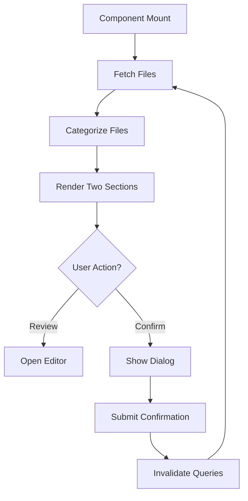
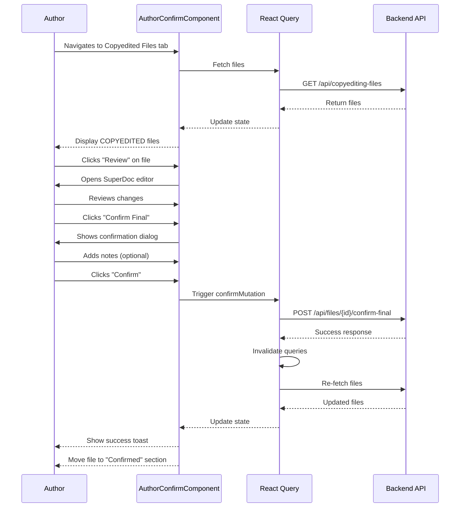
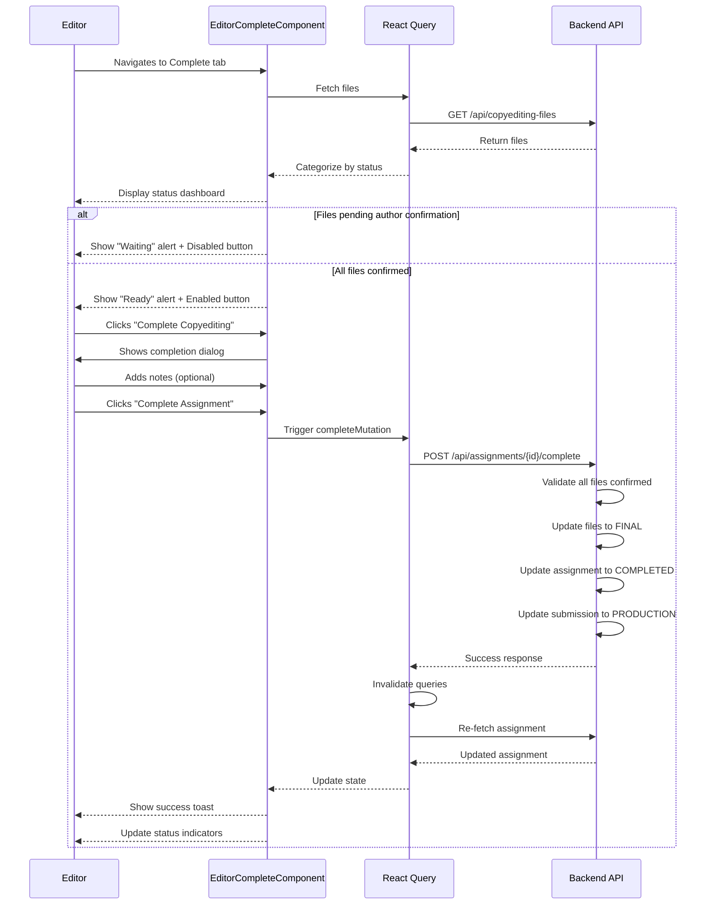

# Copyediting Final Stage Workflow - Frontend Documentation

## Overview

This document describes the frontend implementation of the complete final stage workflow for the copyediting process. The implementation includes React components, API integration, state management with React Query, and user interfaces for both authors and editors.

**Framework:** Next.js 14 (App Router)  
**State Management:** React Query (TanStack Query)  
**UI Library:** shadcn/ui + Tailwind CSS

---

## Table of Contents

1. [Architecture Overview](#architecture-overview)
2. [API Integration](#api-integration)
3. [React Query Hooks](#react-query-hooks)
4. [Components](#components)
5. [User Flows](#user-flows)
6. [File Structure](#file-structure)
7. [Testing Guide](#testing-guide)

---

## Architecture Overview

### Technology Stack

```
┌─────────────────────────────────────────┐
│           Next.js App Router            │
├─────────────────────────────────────────┤
│     React Components (shadcn/ui)        │
├─────────────────────────────────────────┤
│    React Query (State Management)       │
├─────────────────────────────────────────┤
│         Axios (HTTP Client)             │
├─────────────────────────────────────────┤
│        Django REST Framework            │
└─────────────────────────────────────────┘
```

### Component Hierarchy

```
App Router Pages
├── Author Pages
│   ├── AuthorCopyeditingPage
│   │   ├── AuthorConfirmCopyeditedFiles ✅ NEW
│   │   ├── CopyeditingDraftFiles
│   │   ├── CopyeditingDiscussions
│   │   └── CopyeditingParticipants
│
└── Editor Pages
    ├── EditorCopyeditingPage
    │   ├── CopyeditingDraftFiles
    │   ├── CopyeditedFiles (Enhanced) ✅
    │   ├── EditorCompleteCopyediting ✅ NEW
    │   ├── CopyeditingDiscussions
    │   └── CopyeditingParticipants
```

---

## API Integration

### API Service Layer

**Location:** `features/panel/editor/submission/api/copyeditingApi.js`

### New API Functions

#### 1. getCopyeditedFiles

Fetches copyedited files awaiting author confirmation.

```javascript
/**
 * Get copyedited files for an assignment
 * @param {string} assignmentId - Assignment ID
 * @returns {Promise} API response with copyedited files
 */
export const getCopyeditedFiles = async (assignmentId) => {
  const response = await instance.get(
    `submissions/copyediting/assignments/${assignmentId}/copyedited-files/`
  );
  return response.data;
};
```

**Response Structure:**

```javascript
{
  count: 3,
  results: [
    {
      id: "uuid",
      original_filename: "manuscript.docx",
      file_type: "COPYEDITED",
      file_size: 2048576,
      version: 2,
      is_approved: true,
      approved_by: { id: "uuid", first_name: "John", last_name: "Doe" },
      approved_at: "2025-12-10T10:30:00Z",
      uploaded_by: { id: "uuid", first_name: "Jane", last_name: "Smith" },
      created_at: "2025-12-10T09:00:00Z",
      description: "Copyedited manuscript"
    }
  ]
}
```

#### 2. confirmFileFinal

Author confirms a copyedited file as final.

```javascript
/**
 * Author confirms file as final
 * @param {string} fileId - File ID
 * @param {Object} data - Confirmation data
 * @param {string} data.confirmation_notes - Optional notes from author
 * @returns {Promise} API response
 */
export const confirmFileFinal = async (fileId, data = {}) => {
  const response = await instance.post(
    `submissions/copyediting/files/${fileId}/confirm-final/`,
    data
  );
  return response.data;
};
```

**Request Body:**

```javascript
{
  confirmation_notes: "All changes look good"; // optional
}
```

**Response Structure:**

```javascript
{
  status: "success",
  message: "File confirmed as final successfully",
  file: {
    id: "uuid",
    original_filename: "manuscript.docx",
    file_type: "AUTHOR_FINAL",
    version: 2
  },
  confirmed_at: "2025-12-10T14:00:00Z",
  confirmed_by: { id: "uuid", name: "Author Name" },
  confirmation_notes: "All changes look good"
}
```

#### 3. completeCopyediting

Editor completes the copyediting assignment.

```javascript
/**
 * Complete copyediting assignment (editor)
 * @param {string} assignmentId - Assignment ID
 * @param {Object} data - Completion data
 * @param {string} data.completion_notes - Optional notes from editor
 * @returns {Promise} API response
 */
export const completeCopyediting = async (assignmentId, data = {}) => {
  const response = await instance.post(
    `submissions/copyediting/assignments/${assignmentId}/complete/`,
    data
  );
  return response.data;
};
```

**Request Body:**

```javascript
{
  completion_notes: "All files reviewed and approved"; // optional
}
```

**Response Structure:**

```javascript
{
  status: "success",
  message: "Copyediting assignment completed successfully",
  assignment_id: "uuid",
  assignment_status: "COMPLETED",
  submission_status: "PRODUCTION",
  files_finalized: 3,
  completed_at: "2025-12-10T16:00:00Z",
  completed_by: { id: "uuid", name: "Editor Name" },
  completion_notes: "All files reviewed and approved",
  assignment: { /* full assignment object */ }
}
```

---

## React Query Hooks

### Location

`features/panel/editor/submission/hooks/mutation/useCopyeditingFiles.js`

### New Hook: useConfirmFileFinal

Author hook to confirm files as final.

```javascript
/**
 * Hook to confirm file as final (author action)
 */
export function useConfirmFileFinal() {
  const queryClient = useQueryClient();

  return useMutation({
    mutationFn: ({ fileId, data }) => {
      const { confirmFileFinal } = require("../../api");
      return confirmFileFinal(fileId, data);
    },
    onSuccess: (data) => {
      toast.success("File confirmed as final successfully");

      // Invalidate queries to refresh data
      queryClient.invalidateQueries({
        queryKey: ["copyediting-files"],
      });
      queryClient.invalidateQueries({
        queryKey: ["copyediting-file", data.file?.id],
      });
    },
    onError: (error) => {
      const message =
        error?.response?.data?.detail ||
        error?.message ||
        "Failed to confirm file";
      toast.error(message);
    },
  });
}
```

**Usage Example:**

```javascript
const confirmMutation = useConfirmFileFinal();

const handleConfirm = (fileId) => {
  confirmMutation.mutate({
    fileId: fileId,
    data: { confirmation_notes: "Looks good!" },
  });
};
```

### Existing Hook: useCompleteCopyeditingAssignment

Editor hook to complete assignments (already exists).

**Location:** `features/panel/editor/submission/hooks/mutation/useCopyeditingAssignments.js`

```javascript
export function useCompleteCopyeditingAssignment() {
  const queryClient = useQueryClient();

  return useMutation({
    mutationFn: ({ assignmentId, data }) =>
      completeCopyeditingAssignment(assignmentId, data),
    onSuccess: (data) => {
      toast.success("Copyediting completed successfully");
      queryClient.invalidateQueries({
        queryKey: ["copyediting-assignments"],
      });
      queryClient.invalidateQueries({
        queryKey: ["copyediting-assignment", data.id],
      });
    },
    onError: (error) => {
      const message =
        error?.response?.data?.detail ||
        error?.message ||
        "Failed to complete assignment";
      toast.error(message);
    },
  });
}
```

---

## Components

### 1. AuthorConfirmCopyeditedFiles (NEW)

**Location:** `features/panel/editor/submission/components/copyediting/AuthorConfirmCopyeditedFiles.jsx`

**Purpose:** Allows authors to review and confirm copyedited files.

#### Component Structure

```jsx
export function AuthorConfirmCopyeditedFiles({
  assignmentId,
  submission,
  submissionId,
}) {
  // State management
  const [selectedFile, setSelectedFile] = useState(null);
  const [isConfirmDialogOpen, setIsConfirmDialogOpen] = useState(false);
  const [confirmationNotes, setConfirmationNotes] = useState("");

  // Data fetching
  const {
    data: filesData,
    isLoading,
    error,
  } = useCopyeditingFiles(
    { submission: submissionId },
    { enabled: !!submissionId }
  );

  // Categorize files
  const { awaitingConfirmation, confirmed } = useMemo(() => {
    const files = filesData?.results || [];
    return {
      awaitingConfirmation: files.filter((f) => f.file_type === "COPYEDITED"),
      confirmed: files.filter((f) => f.file_type === "AUTHOR_FINAL"),
    };
  }, [filesData]);

  // Mutation
  const confirmMutation = useConfirmFileFinal();

  // Handlers
  const handleConfirm = () => {
    confirmMutation.mutate(
      {
        fileId: selectedFile.id,
        data: { confirmation_notes: confirmationNotes },
      },
      {
        onSuccess: () => {
          setIsConfirmDialogOpen(false);
          setSelectedFile(null);
          setConfirmationNotes("");
        },
      }
    );
  };

  return (
    <Card>
      <CardHeader>...</CardHeader>
      <CardContent>
        {/* Files awaiting confirmation */}
        {/* Already confirmed files */}
        {/* Confirmation dialog */}
      </CardContent>
    </Card>
  );
}
```

#### Key Features

1. **Two File Sections**

   - Files Awaiting Confirmation (COPYEDITED status)
   - Already Confirmed Files (AUTHOR_FINAL status)

2. **File Actions**

   - Review button (opens file in SuperDoc editor)
   - Confirm Final button (with confirmation dialog)
   - Download button

3. **Status Indicators**

   - Badge showing file status
   - Visual distinction between confirmed and pending files
   - File metadata display (size, version, upload date)

4. **Confirmation Dialog**
   - Optional notes field
   - Summary of action
   - Confirm/Cancel buttons

#### Props

| Prop         | Type   | Required | Description                 |
| ------------ | ------ | -------- | --------------------------- |
| assignmentId | string | Yes      | Copyediting assignment UUID |
| submission   | object | No       | Submission data object      |
| submissionId | string | Yes      | Submission UUID             |

#### Component Lifecycle



---

### 2. EditorCompleteCopyediting (NEW)

**Location:** `features/panel/editor/submission/components/copyediting/EditorCompleteCopyediting.jsx`

**Purpose:** Allows editors to complete copyediting and move submission to production.

#### Component Structure

```jsx
export function EditorCompleteCopyediting({
  assignmentId,
  submission,
  submissionId,
}) {
  // State
  const [isCompleteDialogOpen, setIsCompleteDialogOpen] = useState(false);
  const [completionNotes, setCompletionNotes] = useState("");

  // Fetch all files
  const {
    data: filesData,
    isLoading,
    error,
  } = useCopyeditingFiles(
    { submission: submissionId },
    { enabled: !!submissionId }
  );

  // Categorize files by status
  const filesByStatus = useMemo(() => {
    const files = filesData?.results || [];
    return {
      draft: files.filter((f) => f.file_type === "DRAFT"),
      copyedited: files.filter((f) => f.file_type === "COPYEDITED"),
      authorFinal: files.filter((f) => f.file_type === "AUTHOR_FINAL"),
      final: files.filter((f) => f.file_type === "FINAL"),
    };
  }, [filesData]);

  // Check if ready to complete
  const canComplete = useMemo(() => {
    // Must have at least one AUTHOR_FINAL file
    if (filesByStatus.authorFinal.length === 0) return false;
    // Must not have any COPYEDITED files (all must be confirmed)
    if (filesByStatus.copyedited.length > 0) return false;
    return true;
  }, [filesByStatus]);

  // Mutation
  const completeMutation = useCompleteCopyeditingAssignment();

  return (
    <Card>
      <CardHeader>...</CardHeader>
      <CardContent>
        {/* File Status Overview */}
        {/* Completion Requirements */}
        {/* Status Messages */}
        {/* Complete Button */}
        {/* Completion Dialog */}
      </CardContent>
    </Card>
  );
}
```

#### Key Features

1. **File Status Dashboard**

   - Draft Files count
   - Awaiting Author Confirmation count (with warning if > 0)
   - Author Confirmed count (with success indicator)
   - Final (Production) count

2. **Validation Requirements Display**

   - ✅ At least one file confirmed by author
   - ✅ All copyedited files confirmed by author
   - Visual indicators (green check or red X)

3. **Status Alerts**

   - Info alert when waiting for author
   - Success alert when ready to complete
   - Shows specific counts and details

4. **Completion Dialog**
   - Summary of what will happen
   - Optional completion notes
   - Confirm/Cancel buttons

#### Props

| Prop         | Type   | Required | Description                 |
| ------------ | ------ | -------- | --------------------------- |
| assignmentId | string | Yes      | Copyediting assignment UUID |
| submission   | object | No       | Submission data object      |
| submissionId | string | Yes      | Submission UUID             |

#### Validation Logic

```javascript
// Check 1: Must have author-confirmed files
const hasAuthorConfirmation = filesByStatus.authorFinal.length > 0;

// Check 2: No pending copyedited files
const noPendingFiles = filesByStatus.copyedited.length === 0;

// Can complete only if both checks pass
const canComplete = hasAuthorConfirmation && noPendingFiles;
```

#### UI States

| State              | Condition                | Button   | Alert           |
| ------------------ | ------------------------ | -------- | --------------- |
| Waiting for Author | copyedited.length > 0    | Disabled | Info (orange)   |
| No Confirmations   | authorFinal.length === 0 | Disabled | Info (orange)   |
| Ready to Complete  | canComplete === true     | Enabled  | Success (green) |
| Completing         | mutation.isPending       | Loading  | -               |

---

### 3. CopyeditedFiles (ENHANCED)

**Location:** `features/panel/editor/submission/components/copyediting/CopyeditedFiles.jsx`

**Enhancement:** Added status badges to show file workflow state.

#### Changes Made

```jsx
// Before
<Badge variant="success" className="text-xs">
  Approved
</Badge>;

// After - Enhanced with file status
{
  file.file_type === "AUTHOR_FINAL" && (
    <Badge variant="success" className="text-xs">
      Author Confirmed
    </Badge>
  );
}
{
  file.file_type === "COPYEDITED" && (
    <Badge
      variant="outline"
      className="text-xs border-orange-500 text-orange-600"
    >
      Awaiting Author
    </Badge>
  );
}
{
  file.file_type === "FINAL" && (
    <Badge className="text-xs bg-blue-600">Final</Badge>
  );
}
```

#### Badge Types

| File Type    | Badge Style | Color  | Text               |
| ------------ | ----------- | ------ | ------------------ |
| COPYEDITED   | outline     | Orange | "Awaiting Author"  |
| AUTHOR_FINAL | success     | Green  | "Author Confirmed" |
| FINAL        | default     | Blue   | "Final"            |

---

## User Flows

### Author Flow: Confirming Files



### Editor Flow: Completing Assignment



---

## File Structure

```
frontend-journal-portal/
├── app/
│   └── (panel)/
│       ├── author/
│       │   └── submissions/
│       │       └── active/
│       │           └── [id]/
│       │               └── copyediting/
│       │                   └── page.jsx ✅ UPDATED
│       └── editor/
│           └── submissions/
│               └── [id]/
│                   └── copyediting/
│                       └── page.jsx ✅ UPDATED
│
├── features/
│   └── panel/
│       └── editor/
│           └── submission/
│               ├── api/
│               │   ├── copyeditingApi.js ✅ UPDATED
│               │   └── index.js
│               ├── hooks/
│               │   ├── mutation/
│               │   │   ├── useCopyeditingFiles.js ✅ UPDATED
│               │   │   └── useCopyeditingAssignments.js
│               │   └── index.js
│               └── components/
│                   └── copyediting/
│                       ├── AuthorConfirmCopyeditedFiles.jsx ✅ NEW
│                       ├── EditorCompleteCopyediting.jsx ✅ NEW
│                       ├── CopyeditedFiles.jsx ✅ ENHANCED
│                       └── index.js ✅ UPDATED
```

---

## Integration Points

### 1. Author Copyediting Page Integration

**File:** `app/(panel)/author/submissions/active/[id]/copyediting/page.jsx`

```jsx
import { AuthorConfirmCopyeditedFiles } from "@/features/panel/editor/submission/components/copyediting/AuthorConfirmCopyeditedFiles";

export default function AuthorCopyeditingPage() {
  // ... existing code ...

  return (
    <Tabs defaultValue="copyedited">
      {/* ... other tabs ... */}

      <TabsContent value="copyedited">
        <div className="grid grid-cols-1 lg:grid-cols-3 gap-6">
          <div className="lg:col-span-2">
            <AuthorConfirmCopyeditedFiles
              assignmentId={assignmentId}
              submission={submission}
              submissionId={submissionId}
            />
          </div>
          <div>
            <CopyeditingParticipants
              assignmentId={assignmentId}
              isAuthorView={true}
            />
          </div>
        </div>
      </TabsContent>
    </Tabs>
  );
}
```

### 2. Editor Copyediting Page Integration

**File:** `app/(panel)/editor/submissions/[id]/copyediting/page.jsx`

```jsx
import { EditorCompleteCopyediting } from "@/features/panel/editor/submission/components/copyediting/EditorCompleteCopyediting";

export default function CopyeditingWorkflowPage() {
  // ... existing code ...

  return (
    <Tabs defaultValue="draft">
      {/* ... other tabs ... */}

      <TabsContent value="complete">
        <div className="grid grid-cols-1 xl:grid-cols-3 gap-6">
          <div className="lg:col-span-2">
            <EditorCompleteCopyediting
              assignmentId={assignmentId}
              submission={submission}
              submissionId={submissionId}
            />
          </div>
          <div>
            <CopyeditingParticipants assignmentId={assignmentId} />
          </div>
        </div>
      </TabsContent>
    </Tabs>
  );
}
```

---

## Testing Guide

### Unit Testing

#### Test API Functions

```javascript
import {
  getCopyeditedFiles,
  confirmFileFinal,
  completeCopyediting,
} from "./copyeditingApi";

describe("Copyediting API", () => {
  test("getCopyeditedFiles returns filtered files", async () => {
    const files = await getCopyeditedFiles("assignment-id");
    expect(files.results).toBeInstanceOf(Array);
    expect(files.results[0].file_type).toBe("COPYEDITED");
  });

  test("confirmFileFinal sends correct payload", async () => {
    const response = await confirmFileFinal("file-id", {
      confirmation_notes: "Test note",
    });
    expect(response.status).toBe("success");
    expect(response.file.file_type).toBe("AUTHOR_FINAL");
  });

  test("completeCopyediting validates requirements", async () => {
    const response = await completeCopyediting("assignment-id", {
      completion_notes: "Test",
    });
    expect(response.assignment_status).toBe("COMPLETED");
    expect(response.submission_status).toBe("PRODUCTION");
  });
});
```

#### Test React Query Hooks

```javascript
import { renderHook, waitFor } from "@testing-library/react";
import { useConfirmFileFinal } from "./useCopyeditingFiles";

describe("useConfirmFileFinal", () => {
  test("successfully confirms file", async () => {
    const { result } = renderHook(() => useConfirmFileFinal());

    act(() => {
      result.current.mutate({
        fileId: "test-id",
        data: { confirmation_notes: "Looks good" },
      });
    });

    await waitFor(() => expect(result.current.isSuccess).toBe(true));
    expect(result.current.data.file.file_type).toBe("AUTHOR_FINAL");
  });
});
```

### Integration Testing

#### Test Author Confirmation Flow

```javascript
import { render, screen, fireEvent, waitFor } from "@testing-library/react";
import AuthorConfirmCopyeditedFiles from "./AuthorConfirmCopyeditedFiles";

describe("AuthorConfirmCopyeditedFiles", () => {
  test("displays files awaiting confirmation", async () => {
    render(
      <AuthorConfirmCopyeditedFiles
        assignmentId="test-id"
        submissionId="sub-id"
      />
    );

    await waitFor(() => {
      expect(
        screen.getByText("Files Awaiting Your Confirmation")
      ).toBeInTheDocument();
    });
  });

  test("confirms file successfully", async () => {
    render(
      <AuthorConfirmCopyeditedFiles
        assignmentId="test-id"
        submissionId="sub-id"
      />
    );

    // Click confirm button
    const confirmBtn = await screen.findByText("Confirm Final");
    fireEvent.click(confirmBtn);

    // Fill dialog
    const notesInput = screen.getByPlaceholderText(/notes/i);
    fireEvent.change(notesInput, { target: { value: "Test notes" } });

    // Submit
    const submitBtn = screen.getByText("Confirm as Final");
    fireEvent.click(submitBtn);

    // Verify success
    await waitFor(() => {
      expect(screen.getByText(/confirmed successfully/i)).toBeInTheDocument();
    });
  });
});
```

#### Test Editor Completion Flow

```javascript
import { render, screen, fireEvent, waitFor } from "@testing-library/react";
import EditorCompleteCopyediting from "./EditorCompleteCopyediting";

describe("EditorCompleteCopyediting", () => {
  test("shows warning when files not confirmed", async () => {
    // Mock files with COPYEDITED status
    render(
      <EditorCompleteCopyediting assignmentId="test-id" submissionId="sub-id" />
    );

    await waitFor(() => {
      expect(
        screen.getByText(/awaiting author confirmation/i)
      ).toBeInTheDocument();
    });

    const completeBtn = screen.getByText("Complete Copyediting");
    expect(completeBtn).toBeDisabled();
  });

  test("enables completion when ready", async () => {
    // Mock files with AUTHOR_FINAL status
    render(
      <EditorCompleteCopyediting assignmentId="test-id" submissionId="sub-id" />
    );

    await waitFor(() => {
      expect(screen.getByText(/ready to complete/i)).toBeInTheDocument();
    });

    const completeBtn = screen.getByText("Complete Copyediting");
    expect(completeBtn).not.toBeDisabled();
  });

  test("completes assignment successfully", async () => {
    render(
      <EditorCompleteCopyediting assignmentId="test-id" submissionId="sub-id" />
    );

    // Wait for ready state
    await waitFor(() => {
      expect(screen.getByText(/ready to complete/i)).toBeInTheDocument();
    });

    // Click complete
    const completeBtn = screen.getByText("Complete Copyediting");
    fireEvent.click(completeBtn);

    // Confirm in dialog
    const confirmBtn = await screen.findByText("Complete Assignment");
    fireEvent.click(confirmBtn);

    // Verify success
    await waitFor(() => {
      expect(screen.getByText(/completed successfully/i)).toBeInTheDocument();
    });
  });
});
```

### Manual Testing Checklist

#### Author Workflow

- [ ] Navigate to author copyediting page
- [ ] See "Copyedited Files" tab
- [ ] View files awaiting confirmation
- [ ] Click "Review" and verify editor opens
- [ ] Click "Confirm Final" and see dialog
- [ ] Add optional confirmation notes
- [ ] Confirm file
- [ ] Verify success toast appears
- [ ] Verify file moves to "Confirmed" section
- [ ] Verify badge changes to "Author Confirmed"
- [ ] Verify file disappears from editor's "Awaiting" list

#### Editor Workflow

- [ ] Navigate to editor copyediting page
- [ ] See "Complete" tab
- [ ] View file status dashboard
- [ ] Verify counts are correct
- [ ] When files pending: See warning alert, disabled button
- [ ] When ready: See success alert, enabled button
- [ ] Click "Complete Copyediting"
- [ ] See completion dialog with summary
- [ ] Add optional completion notes
- [ ] Confirm completion
- [ ] Verify success toast appears
- [ ] Verify assignment status changes to "COMPLETED"
- [ ] Verify submission status changes to "PRODUCTION"
- [ ] Verify all files show "Final" badge

---

## Error Handling

### API Error Responses

All API calls include error handling with user-friendly messages:

```javascript
onError: (error) => {
  const message =
    error?.response?.data?.detail || // Backend validation error
    error?.message || // Network error
    "Failed to [action]"; // Generic fallback
  toast.error(message);
};
```

### Common Error Scenarios

| Error           | Cause                      | User Message                                | Solution                      |
| --------------- | -------------------------- | ------------------------------------------- | ----------------------------- |
| 403 Forbidden   | Not submission author      | "Only submission authors can confirm files" | Verify user permissions       |
| 400 Bad Request | File not COPYEDITED        | "Only copyedited files can be confirmed"    | Check file status             |
| 400 Bad Request | No author confirmations    | "No files confirmed by author yet"          | Author must confirm files     |
| 400 Bad Request | Pending files exist        | "X file(s) awaiting confirmation"           | Author must confirm all files |
| 400 Bad Request | Assignment not in progress | "Assignment must be in progress"            | Check assignment status       |

---

## Performance Optimizations

### 1. React Query Caching

```javascript
// Files are cached with 5-minute stale time
const { data } = useCopyeditingFiles(
  { submission: submissionId },
  {
    enabled: !!submissionId,
    staleTime: 5 * 60 * 1000, // 5 minutes
    cacheTime: 10 * 60 * 1000, // 10 minutes
  }
);
```

### 2. Query Invalidation Strategy

```javascript
// Invalidate specific queries after mutations
queryClient.invalidateQueries({ queryKey: ["copyediting-files"] });
queryClient.invalidateQueries({ queryKey: ["copyediting-file", fileId] });
queryClient.invalidateQueries({ queryKey: ["copyediting-assignments"] });
```

### 3. Memoization

```javascript
// Memoize expensive computations
const filesByStatus = useMemo(() => {
  const files = filesData?.results || [];
  return {
    draft: files.filter((f) => f.file_type === "DRAFT"),
    copyedited: files.filter((f) => f.file_type === "COPYEDITED"),
    authorFinal: files.filter((f) => f.file_type === "AUTHOR_FINAL"),
    final: files.filter((f) => f.file_type === "FINAL"),
  };
}, [filesData]);
```

### 4. Optimistic Updates (Future Enhancement)

```javascript
// Optimistically update UI before server confirms
const confirmMutation = useConfirmFileFinal({
  onMutate: async ({ fileId }) => {
    // Cancel outgoing queries
    await queryClient.cancelQueries(["copyediting-files"]);

    // Snapshot previous value
    const previousFiles = queryClient.getQueryData(["copyediting-files"]);

    // Optimistically update
    queryClient.setQueryData(["copyediting-files"], (old) => ({
      ...old,
      results: old.results.map((f) =>
        f.id === fileId ? { ...f, file_type: "AUTHOR_FINAL" } : f
      ),
    }));

    return { previousFiles };
  },
  onError: (err, variables, context) => {
    // Rollback on error
    queryClient.setQueryData(["copyediting-files"], context.previousFiles);
  },
});
```

---

## Accessibility

### Keyboard Navigation

- All buttons are keyboard accessible (Tab, Enter)
- Dialogs can be closed with Escape
- Focus management in dialogs
- ARIA labels on interactive elements

### Screen Reader Support

```jsx
<Button aria-label="Confirm file as final">
  Confirm Final
</Button>

<Alert role="alert" aria-live="polite">
  Ready to complete! All files confirmed.
</Alert>
```

### Color Contrast

All status badges meet WCAG AA standards:

- Success (green): #16a34a
- Warning (orange): #ea580c
- Info (blue): #2563eb

---

## Future Enhancements

### Planned Features

1. **Real-time Updates** - WebSocket integration for live status updates
2. **Batch Operations** - Confirm multiple files at once
3. **File Comparison** - Side-by-side diff view
4. **Email Notifications** - Automatic emails on status changes
5. **Mobile Optimization** - Responsive design improvements
6. **Export Functionality** - Download confirmation receipts
7. **Activity Timeline** - Visual timeline of file history
8. **Comments on Files** - Thread-based discussions per file

### Technical Debt

- [ ] Add comprehensive error boundaries
- [ ] Implement retry logic for failed requests
- [ ] Add loading skeletons instead of spinners
- [ ] Optimize bundle size (code splitting)
- [ ] Add E2E tests with Playwright
- [ ] Implement analytics tracking

---

## Troubleshooting

### Common Issues

#### Files Not Appearing

**Symptom:** Author doesn't see files in confirmation list

**Solutions:**

1. Check if files have `file_type='COPYEDITED'`
2. Verify API response with network tab
3. Check React Query cache
4. Ensure submissionId is correct

#### Mutation Not Working

**Symptom:** Confirm button doesn't work

**Solutions:**

1. Check console for errors
2. Verify API endpoint is reachable
3. Check authentication token
4. Verify file status allows confirmation

#### Cache Not Updating

**Symptom:** UI doesn't refresh after mutation

**Solutions:**

1. Verify query invalidation calls
2. Check queryKey matches
3. Clear React Query cache manually
4. Check browser console for errors

---

## API Reference Quick Guide

### Author APIs

| Action               | Endpoint                              | Method | Hook                |
| -------------------- | ------------------------------------- | ------ | ------------------- |
| Get copyedited files | `/assignments/{id}/copyedited-files/` | GET    | useCopyeditingFiles |
| Confirm file         | `/files/{id}/confirm-final/`          | POST   | useConfirmFileFinal |

### Editor APIs

| Action              | Endpoint                      | Method | Hook                             |
| ------------------- | ----------------------------- | ------ | -------------------------------- |
| Get all files       | `/files/`                     | GET    | useCopyeditingFiles              |
| Complete assignment | `/assignments/{id}/complete/` | POST   | useCompleteCopyeditingAssignment |

---

## Related Documentation

- [Backend API Documentation](./COPYEDITING_FINAL_STAGE_BACKEND.md)
- [Component Storybook](./storybook-components.md)
- [API Integration Guide](./API_INTEGRATION.md)
- [Testing Strategy](./TESTING.md)

---

**Version:** 1.0.0  
**Authors:** Development Team
